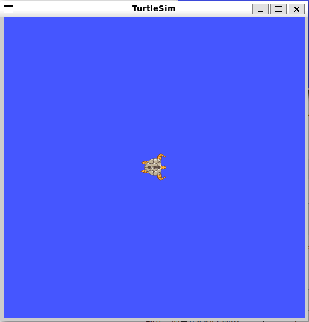

# 理解ROS节点

>计算图（Computation Graph）是一个由ROS进程组成的点对点网络，它们能够共同处理数据。ROS的基本计算图概念有`节点`（Nodes）、`主节点`（Master）、`参数服务器`（Parameter Server）、消息（Messages）、服务（Services）、`话题`（Topics）和`袋`（Bags），它们都以不同的方式向`图`（Graph）提供数据。

- `节点`（Nodes）：节点是一个可执行文件，它可以通过ROS来与其他节点进行通信。
- `消息`（Messages）：订阅或发布话题时所使用的ROS数据类型。
- `话题`（Topics）：节点可以将消息发布到话题，或通过订阅话题来接收消息。
- `主节点`（Master）：ROS的命名服务，例如帮助节点发现彼此。
- `rosout`：在ROS中相当于stdout/stderr（标准输出/标准错误）。
- `roscore`：主节点 + rosout + 参数服务器（会在以后介绍）。

## 节点(Nodes)介绍

节点实际上只不过是ROS软件包中的一个可执行文件。ROS节点使用ROS客户端库与其他节点通信。节点可以发布或订阅话题，也可以提供或使用服务。
> `注：节点是ROS中非常重要的一个概念，为了帮助初学者理解这个概念，这里举一个通俗的例子：`
> 
>例如，咱们有一个机器人，和一个遥控器，那么这个机器人和遥控器开始工作后，就是两个节点。遥控器起到了下达指 令的作用；机器人负责监听遥控器下达的指令，完成相应动作。从这里我们可以看出，节点是一个能执行特定工作任 务的工作单元，并且能够相互通信，从而实现一个机器人系统整体的功能。在这里我们把遥控器和机器人简单定义为两个节点，实际上在机器人中根据控制器、传感器、执行机构等不同组成模块，还可以将其进一步细分为更多的节点，这个是根据用户编写的程序来定义的。）

## 客户端库

ROS客户端库可以让用不同编程语言编写的节点进行相互通信：

>rospy = Python客户端库
>roscpp = C++客户端库

## **roscore**

roscore是你在运行所有ROS程序前首先要运行的命令。

    $ roscore
注: 单机运行时,需要配置单机hosts,官网推荐如下配置:

    $ export ROS_HOSTNAME=localhost
    $ export ROS_MASTER_URI=http://localhost:11311

    可以在~/.bashrc 中文末添加这两行,即可每次启动终端自动export

多机运行时,修改 `/etc/hosts` ,参考微雪的[`hosts修改`](https://www.waveshare.net/wiki/JetRacer_ROS_AI_Kit_%E6%95%99%E7%A8%8B%E5%9B%9B%E3%80%81%E9%85%8D%E7%BD%AE%E5%A4%9A%E6%9C%BA%E9%80%9A%E8%AE%AF)

然后会看到如下信息:

    ... logging to ~/.ros/log/9cf88ce4-b14d-11df-8a75-00251148e8cf/roslaunch-machine_name-13039.log
    Checking log directory for disk usage. This may take awhile.
    Press Ctrl-C to interrupt
    Done checking log file disk usage. Usage is <1GB.

    started roslaunch server http://machine_name:33919/
    ros_comm version 1.4.7

    SUMMARY
    ========

    PARAMETERS
    * /rosversion
    * /rosdistro

    NODES

    auto-starting new master
    process[master]: started with pid [13054]
    ROS_MASTER_URI=http://machine_name:11311/

    setting /run_id to 9cf88ce4-b14d-11df-8a75-00251148e8cf
    process[rosout-1]: started with pid [13067]
    started core service [/rosout]

## **rosnode**

打开一个新终端，可以使用rosnode看看roscore运行时干了些什么…… 记得要保持以前的终端开着.

    注意： 
    1.当打开一个新的终端时，环境将会重置，~/.bashrc文件将会生效。
    如果你在运行rosnode等命令时出现一些问题，那么可能需要将一些环境设置文件添加到~/.bashrc或手动source一下。
    2.同上,需要添加`ROS_HOSTNAME`以及`ROS_MASTER_URI`.

之后,使用`rosnode`查看节点信息

    $ rosnode list

    会看到：
    /rosout

## **rosrun**
rosrun可以让你用包名直接运行软件包内的节点（而不需要知道包的路径）.
用法:

    $ rosrun [package_name] [node_name]

在新终端中运行小乌龟测试程序(`turtlesim包中的turtlesim_node`)

    $ rosrun turtlesim turtlesim_node

就会出现turtlesim窗口,WSL更新后应该会自动弹出

之后可以在新终端中,使用`rosnode list`查看运行的节点.

    会看到:
    /rosout
    /turtlesim
### 节点重命名
ROS有一个强大的功能，就是你可以通过命令行重新分配名称。

    $ rosrun turtlesim turtlesim_node __name:=my_turtle

    使用 __name:=xxxxx 参数进行运行节点的重命名.

    会看到:
    /rosout
    /my_turtle

>注意:重命名之后,只能通过新名称访问

    rosnode ping my_turtle 

    结果:
    rosnode: node is [/my_turtle]
    pinging /my_turtle with a timeout of 3.0s
    xmlrpc reply from http://localhost:45091/       time=0.697613ms
    xmlrpc reply from http://localhost:45091/       time=0.524759ms
    ...

    rosnode ping turtlesim_node

    结果:
    rosnode: node is [/turtlesim_node]
    cannot ping [/turtlesim_node]: unknown node 

# 总结

>roscore = ros+core：主节点(为ROS提供命名服务) + rosout (stdout/stderr) + 参数服务器
rosnode = ros+node：获取节点信息的ROS工具
rosrun = ros+run：运行给定的软件包中的节点

roscore为主节点master运行,至少会产生一个rosout节点 