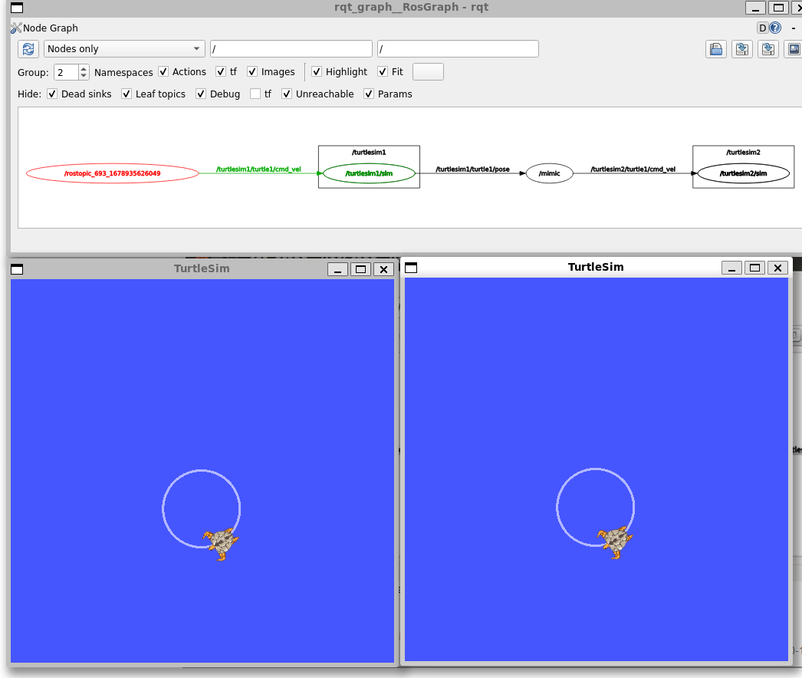

# roslaunch
roslaunch可以用来启动定义在launch（启动）文件中的节点。
可以理解成脚本，用于批量启用或者集群交互节点。

## launch文件
现在一起创建一个名为turtlemimic.launch的launch文件并复制粘贴以下内容进去：
```xml
<launch>  
<!-- 首先用launch标签开头，以表明这是一个launch文件。-->
  <group ns="turtlesim1">
    <node pkg="turtlesim" name="sim" type="turtlesim_node"/>
  </group>

  <group ns="turtlesim2">
    <node pkg="turtlesim" name="sim" type="turtlesim_node"/>
  </group>
 
 <!-- 此处我们创建了两个分组，并以命名空间（namespace）(缩写ns)标签来区分，
 其中一个名为turtulesim1，另一个名为turtlesim2，
 两个分组中都有相同的名为sim的turtlesim节点。
 这样可以让我们同时启动两个turtlesim模拟器，而不会产生命名冲突。-->
   <node pkg="turtlesim" name="mimic" type="mimic">
     <remap from="input" to="turtlesim1/turtle1"/>
     <remap from="output" to="turtlesim2/turtle1"/>
   </node>
 <!--
    在这里我们启动模仿节点，话题的输入和输出分别重命名为turtlesim1和turtlesim2，
    这样就可以让turtlesim2模仿turtlesim1了。
 -->
 </launch>
 <!-- launch文件结尾 -->
```
通过roslaunch命令来运行launch文件：

    $ roslaunch beginner_tutorials turtlemimic.launch

现在将会有两个turtlesim被启动，根据launch文件，turtlesim1为主机，turtlesim2为从机。
他们通过一个叫mimic的服务进行转接。



