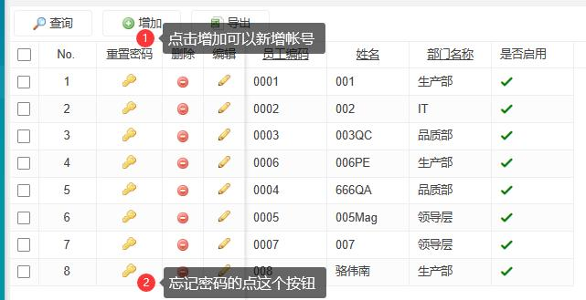
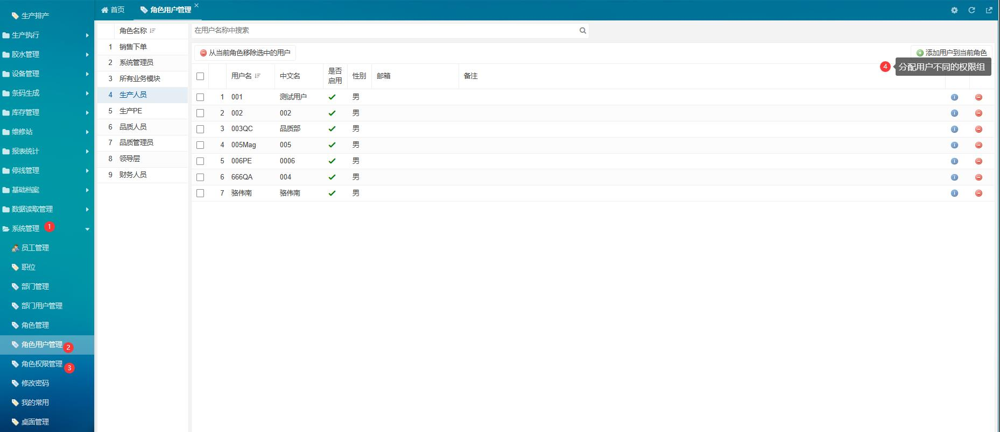
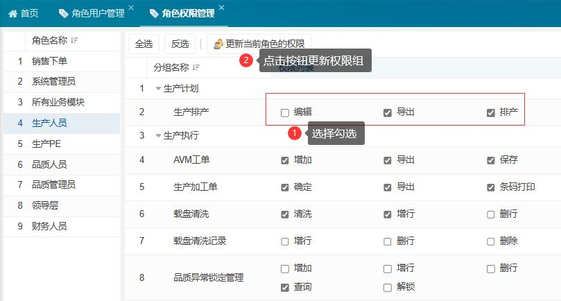
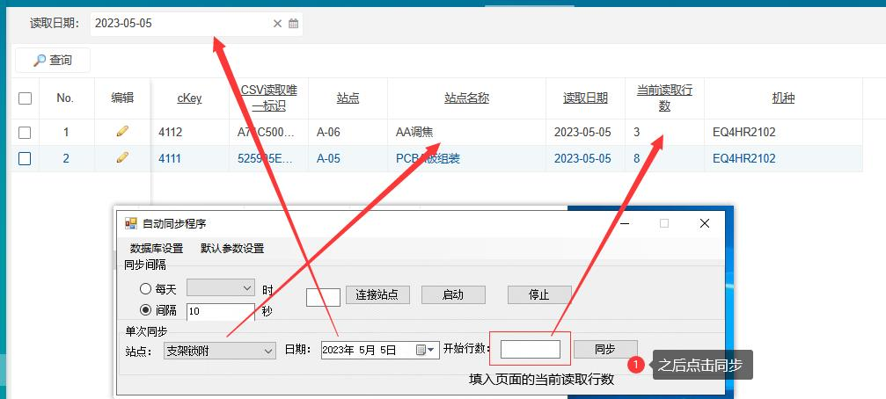
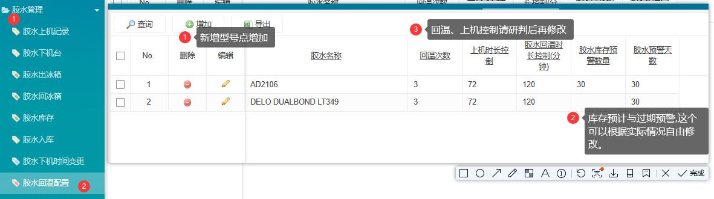
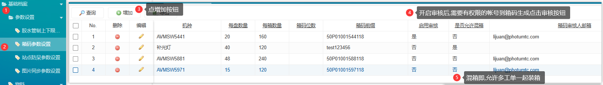
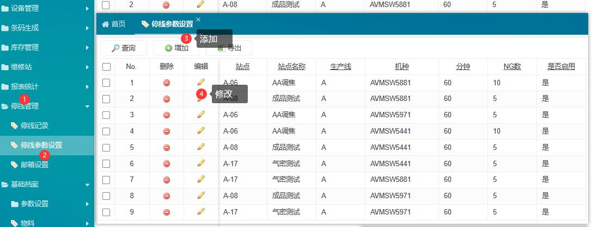
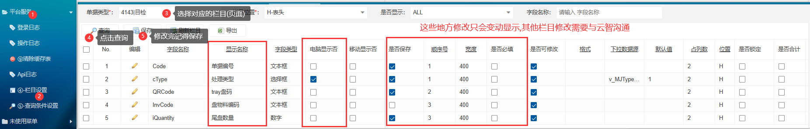
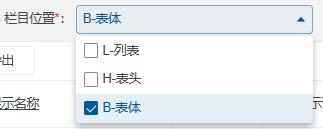
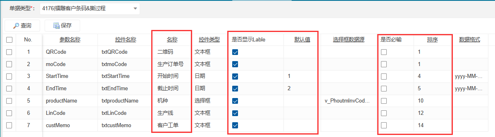

# MES管理员
该文档仅限技术管理人员查阅

## 权限管理
用来赋予其他帐号权限
##### 系统管理
1. `员工管理`:用来新建用户与修改密码。其中姓名为登录的帐号。

1. `角色用户管理`:用来分配用户权限,即把不同的人分配给不同的权限组。比如QC帐号添加到`生产人员与`品质人员`即可叠加两个组的权限。

1. `角色权限管理`:给不同的组单独配置权限。

## 数据读取管理
用来查看当前站点的读数。配合抓取程序的`单次读取`使用。

## 胶水管控
胶水的相关参数管控,其中预警的设置仅会影响首页的提示,可以根据天数自由修改。

## 箱码参数设置
`开启审核`:开启后箱码生成界面需要审核通过之后才能使用。并通过填写的邮箱通知审核人。
`是否允许混箱`:指在包装时,能够使用不同的工单号的产品放进同一个箱码。
`审核人邮箱`:箱码生成点击保存后会发生一封邮箱通知审核人。

## 停线管理
主要修改`分钟`与`NG数`,意思为`60分钟内`出现的NG数量超过设置的`NG数`则触发停线。

## MES页面的显示格式
#### 栏目修改(各页面的表头)
使用管理员帐号登录,在`平台服务`-`④栏目设置`中寻找栏目进行修改,修改后显示与导出的excel表格会跟着变动。
- 可修改项:
  1. 显示名称:表头的名称
  2. 电脑显示否:设置是否显示该列(已隐藏的列会放在`PC-hide`中,在查询条件中把是否显示换成`ALL`可以看到全部列)
  3. 顺序号:调整页面表格的显示顺序
  4. 宽度:设置默认的栏目宽度,不用自己一个个拉长度。

1. 栏目位置:
   - `L-列表`是页面显示的表格。
   - `H-表头`是增加按钮里边的界面
   - `B-表体`是类似`目检`、`包装`中的批量保存的表头。

#### 查询条件
在`平台服务`-`⑤查询条件设置`中寻找对应栏目进行修改。
1. `名称`:查询栏目前边的名称。
2. `是否显示Lable`:取消勾选后,该查询栏目不显示,查询时按默认值搜索
3. `是否必须`:是否为必填项,勾选后不填写则无法查询
4. `排序`:查询栏的前后顺序。

## 管理员帐号
帐号:002
密码:123456789