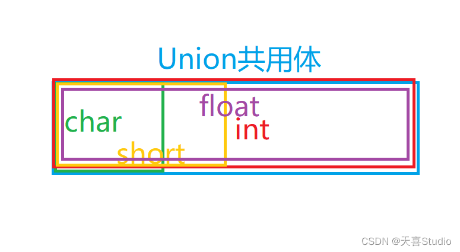

# C++笔记

## 结构体
`struct` 关键词声明


### - 位字段
定义结构体时,在成员变量后加上冒号和数字来指定占用的位数:
```c++
struct A {
  unsigned int a:3; 
  unsigned int b:5;
};
```
在内存控制严格的场景中,应该对bool类型也设置位字段为1.
```C++
struct A {
  bool goodIn:1;
}
```
因为结构体的内存对齐规则,编译器会调整每个成员变量的偏移地址来优化内存访问速度。
`bool`类型可能会被编译器分配1个或者4个字节的空间。

## 共用体
`union` 关键词声明


特点：其内部的数据 共用一个内存首地址，共享同一段内存，以达到节省空间的目的。

1. 共用体的长度为其最大成员的长度。
2. 共用内存,修改共用体其中一个成员的时候,会覆盖整个共用体数据为最新的赋值。
3. 在嵌入式中会比较常用,通过共用体来拆解各字节进行像素级的控制。
4. 可以用一个成员赋值,然后用另一个类型的成员进行输出。但需要自己考虑格式问题。

常用:
1. 判断大小端字节序
   
2. 创建别名
``` C++
union Test
{
    OtherTest* othertest; // 第三方库的名字
    MyTest* mytest; // 自己习惯用的名字
}
```

3. 将union中较大对象拆解成各个字节
``` C++
union Test 
{
    int u;
    char bytes[4];
} ;
```


## 枚举
`enum` 关键词声明
```C++
enum name1 {a,b,c};       //不限定作用域  可匿名    传统C语法
enum class name2{d,e,f};  //限定作用域    不可匿名  C++11新扩展

name2::d //限定作用域需配合类名使用
```
`enum` 枚举的成员默认为0开始的递增序列,可自定义,后一个为前一个+1

## 内联函数

关键词 `iuline`
`inline`工具是C++新增的特性。C语言使用预处理器语句`#define`来提供宏——内联代码的原始实现。
`注意`:`内联函数不能递归`
```cpp
#include <iostream>

inline double square(double x){
  return x*x;
}
int main(){
  ...
}
```
使用inline函数的时候,相当于宏定义。
```C++
int main(){
  a = square(5.0);
  b = square(1);
  return 0;
}
//等价于这样写,不会跳转到函数。
int main(){
  a = {return 5.0*5.0};
  b = {return 1.0*1.0};
  return 0;
}

```
